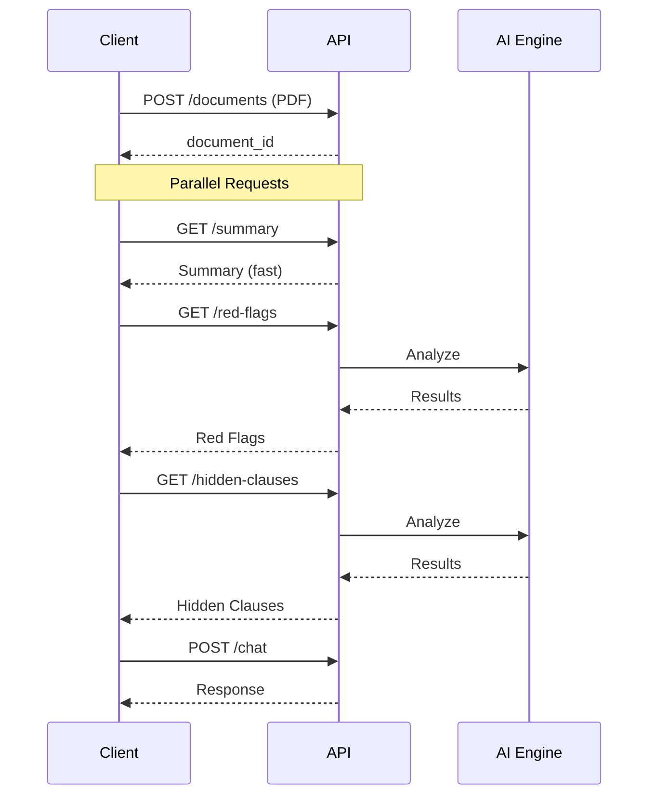

# LoanLens API Design

## 📋 Summary (4 Points)

1. **Document-First Architecture** - Upload PDF once, get a `document_id`, then use it to access all analysis endpoints (summary, red flags, hidden clauses, etc.) without re-uploading
2. **Separation of Concerns** - Each analysis type (summary, red flags, hidden clauses) has its own endpoint for independent loading
3. **Async-Ready** - Long-running analyses return status fields enabling polling/progressive UI updates
4. **Chat Integration** - Conversational endpoint maintains context via `document_id` for follow-up questions

---

## 🔄 API Flow Diagram



---

## 📁 Endpoint Schemas

### 1. Upload Document

```
POST /documents
Content-Type: multipart/form-data
```

**Request:**
| Field | Type | Required | Description |
|-------|------|----------|-------------|
| file | File (PDF) | ✅ | The loan document to analyze |

**Response:** `201 Created`
```json
{
  "document_id": "doc_abc123xyz",
  "filename": "loan_agreement.pdf",
  "uploaded_at": "2026-02-04T10:30:00Z",
  "status": "processing"
}
```

---

### 2. Get Summary

```
GET /documents/{document_id}/summary
```

**Response:** `200 OK`
```json
{
  "document_id": "doc_abc123xyz",
  "status": "complete",
  "data": {
    "document_type": "Personal Loan Agreement",
    "overview": "This is a standard Personal Loan Agreement for $25,000. The interest rate is high (12.5%), and there are strict penalties for late payments or paying it off too early.",
    "key_numbers": {
      "total_loan": 25000.00,
      "monthly_payment": 562.14,
      "interest_rate": 12.50,
      "term_months": 60,
      "total_interest": 8728.40
    },
    "highlights": [
      { "type": "positive", "text": "Fixed Monthly Payment" },
      { "type": "negative", "text": "High Interest Rate" },
      { "type": "warning", "text": "Prepayment Penalty Applies" }
    ]
  }
}
```

---

### 3. Get Red Flags (AI-Detected)

> **Note:** Red flags are **dynamically detected by the LLM** based on document analysis.
> The AI identifies unfavorable terms, compares against industry standards,
> assesses severity, and generates actionable recommendations.

```
GET /documents/{document_id}/red-flags
```

**Response Schema:**
```json
{
  "document_id": "string",
  "status": "complete | processing | failed",
  "count": "number (AI determines how many red flags found)",
  "data": [
    {
      "id": "string",
      "severity": "high | medium | low (AI-assessed)",
      "title": "string (AI-generated concise title)",
      "description": "string (AI explanation of why this is problematic)",
      "location": {
        "page": "number",
        "section": "string"
      },
      "recommendation": "string (AI-generated actionable advice)"
    }
  ]
}
```

**Example Response:** *(AI-detected for a specific document)*
```json
{
  "document_id": "doc_abc123xyz",
  "status": "complete",
  "count": 2,
  "data": [
    {
      "id": "rf_001",
      "severity": "high",
      "title": "Excessive Late Payment Fee",
      "description": "Late payment fee of $75 is significantly above the industry standard of $25-40.",
      "location": { "page": 3, "section": "Section 5.2 - Penalties" },
      "recommendation": "Negotiate a lower late fee or request a grace period extension."
    }
  ]
}
```

**How It Works:**
1. LLM analyzes the entire document
2. Identifies terms unfavorable to the borrower
3. Compares values against industry standards/norms
4. Assesses severity based on financial impact
5. Generates specific, actionable recommendations

---

### 4. Get Hidden Clauses (AI-Detected)

> **Note:** Hidden clauses are **dynamically detected by the LLM**.
> The AI finds buried/complex legal language, extracts the original text,
> translates it to plain English, and assesses the impact on the borrower.

```
GET /documents/{document_id}/hidden-clauses
```

**Response Schema:**
```json
{
  "document_id": "string",
  "status": "complete | processing | failed",
  "count": "number (AI determines how many hidden clauses found)",
  "data": [
    {
      "id": "string",
      "category": "string (AI-assigned: prepayment | arbitration | fees | liability | etc.)",
      "title": "string (AI-generated concise title)",
      "summary": "string (AI-generated 1-line summary)",
      "original_text": "string (exact text extracted from document)",
      "plain_english": "string (AI translation to simple language)",
      "impact": "high | medium | low (AI-assessed impact on borrower)",
      "location": {
        "page": "number",
        "section": "string"
      }
    }
  ]
}
```

**Example Response:** *(AI-detected for a specific document)*
```json
{
  "document_id": "doc_abc123xyz",
  "status": "complete",
  "count": 2,
  "data": [
    {
      "id": "hc_001",
      "category": "prepayment",
      "title": "Prepayment Penalty",
      "summary": "Paying off loan early incurs a 3% penalty of remaining balance.",
      "original_text": "In the event of early termination or prepayment of the principal amount prior to the scheduled maturity date, Borrower shall be liable for a prepayment charge equal to three percent (3%) of the outstanding principal balance...",
      "plain_english": "If you pay off your loan early, you'll be charged 3% of whatever you still owe.",
      "impact": "high",
      "location": { "page": 5, "section": "Section 8.3" }
    }
  ]
}
```

**How It Works:**
1. LLM scans document for complex/buried legal language
2. Identifies clauses that may be unfavorable or easy to miss
3. Extracts the exact original wording
4. Translates legal jargon to plain English
5. Categorizes and assesses impact on the borrower

---

### 5. Get Financial Terms (AI-Extracted)

> **Note:** Terms are **dynamically extracted by the LLM** from each document.
> The AI identifies financial terminology, generates plain English explanations,
> and creates contextual examples based on the actual values in the user's document.

```
GET /documents/{document_id}/financial-terms
GET /documents/{document_id}/financial-terms?search=apr
```

**Query Parameters:**
| Param | Type | Description |
|-------|------|-------------|
| search | string | Optional - filter terms by keyword |

**Response Schema:**
```json
{
  "document_id": "string",
  "status": "complete | processing | failed",
  "count": "number (AI determines how many terms found)",
  "terms": [
    {
      "id": "string",
      "name": "string (AI-extracted term name)",
      "full_name": "string (expanded name if abbreviated)",
      "short_description": "string (1-line AI summary)",
      "definition": "string (AI-generated plain English explanation)",
      "example": {
        "icon": "string (💡 | ⚠️ | ✅)",
        "title": "string",
        "text": "string (AI-generated using actual values from document)"
      },
      "your_value": "string (actual value extracted from this document)",
      "location": {
        "page": "number",
        "section": "string"
      }
    }
  ]
}
```

**Example Response:** *(AI-generated for a specific loan document)*
```json
{
  "document_id": "doc_abc123xyz",
  "status": "complete",
  "count": 3,
  "terms": [
    {
      "id": "term_001",
      "name": "APR",
      "full_name": "Annual Percentage Rate",
      "short_description": "The true cost of borrowing...",
      "definition": "APR is the total yearly cost of your loan, including the interest rate plus any fees...",
      "example": {
        "icon": "💡",
        "title": "Simple Example",
        "text": "Your loan has an interest rate of 12.5%, but with the $500 processing fee included, your APR is actually 13.2%."
      },
      "your_value": "13.2%",
      "location": { "page": 2, "section": "Section 3.1" }
    }
  ]
}
```

**How It Works:**
1. LLM scans the uploaded document
2. Identifies financial/legal terms that need explanation
3. Generates plain English definitions
4. Creates contextual examples using actual values from the document
5. Returns only terms found in THIS specific document

---

### 6. Chat with Document

```
POST /documents/{document_id}/chat
Content-Type: application/json
```

**Request:**
```json
{
  "message": "Can I pay off this loan early without penalty?",
  "conversation_id": "conv_xyz789"  // optional, for context
}
```

**Response:** `200 OK`
```json
{
  "document_id": "doc_abc123xyz",
  "conversation_id": "conv_xyz789",
  "response": "Unfortunately, no. According to Section 8.3 of your loan agreement, there is a prepayment penalty of 3% of the remaining balance if you pay off the loan before the 60-month term ends. For example, if you have $15,000 remaining, you would owe an additional $450 penalty.",
  "references": [
    {
      "clause_id": "hc_001",
      "page": 5,
      "section": "Section 8.3"
    }
  ]
}
```

---

## 🚦 Status Codes

| Code | Meaning |
|------|---------|
| 200 | Success |
| 201 | Document created |
| 202 | Accepted (still processing) |
| 400 | Bad request (invalid file type) |
| 404 | Document not found |
| 422 | Unprocessable (corrupted PDF) |
| 503 | AI service unavailable |

---

## 📊 Processing Status Values

```json
{
  "status": "pending"      // Not started
  "status": "processing"   // In progress
  "status": "complete"     // Done
  "status": "failed"       // Error occurred
}
```

